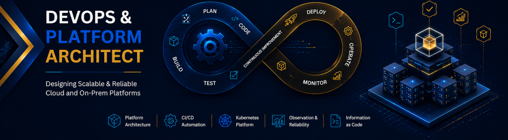
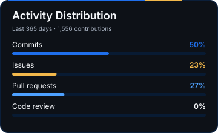
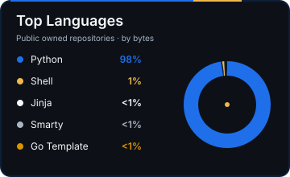

# S.Ali Zahiri

  

  <strong>DevOps & Platform Architect</strong> 
  Building reliable infrastructure, backend services, CI/CD systems, and observable production platforms.

I work at the intersection of platform engineering, backend development, automation, and production operations. My focus is on turning fragile delivery and infrastructure workflows into systems that are repeatable, observable, maintainable, and ready for real-world production use.

Alongside DevOps and platform work, I also build Python-based backend services, APIs, automation tools, and AI-assisted application workflows with attention to deployment, monitoring, reliability, and operational simplicity.

## GitHub Activity

  
  
  

## What I Work On

* Platform foundations for backend, frontend, AI, and infrastructure teams
* Python backend services, APIs, automation tools, and workflow integrations
* AI, LLM, and RAG platform infrastructure with routing, storage, inference, and monitoring concerns
* Kubernetes-ready architecture and scalable service design
* Docker and Docker Compose deployment patterns for production-like environments
* API gateway and reverse proxy layers with Kong, decK, Nginx, Traefik, and APISIX
* GitLab CI templates for build, test, deploy, rollback, and repeatable delivery
* Observability stacks with Prometheus, Grafana, Alertmanager, Loki, exporters, and blackbox checks
* Linux automation, hardening, backup, replication, and operational tooling with Ansible, Python, and Bash

## Focus Areas

| Area                 | Practical Focus                                                             |
| -------------------- | --------------------------------------------------------------------------- |
| Platform Engineering | Production infrastructure, delivery workflows, operational standards        |
| Backend Engineering  | Python services, APIs, automation backends, async/background workflows      |
| CI/CD                | GitLab CI, reusable pipeline templates, Docker image build and deploy       |
| Containers           | Docker, Docker Compose, Kubernetes-ready service design                     |
| Deployment Strategy  | Blue/green patterns, health checks, rollback flows, reverse proxy switching |
| Observability        | Prometheus, Grafana, Alertmanager, Loki, exporters, dashboards              |
| API Gateway          | Kong, decK, Nginx, Traefik, APISIX, routing, access logs, rate limits       |
| AI/LLM Platforms     | RAG, LLM routing, vector databases, GPU inference planning, monitoring      |
| Automation           | Ansible, Python, Bash, Terraform, operational scripts                       |
| Systems              | Linux, Ubuntu, systemd, networking, firewalling, backup and replication     |

## Project Map

### Featured Portfolio Systems

| Project | What it demonstrates | Production signal |
| --- | --- | --- |
| [ai-rag-platform-blueprint](https://github.com/AliZahiri/ai-rag-platform-blueprint) | AI/RAG platform architecture, LLM routing, privacy, source freshness | Provider preflight, citation freshness, and evaluation-slice release gates |
| [gitlab-ci-compose-zero-downtime](https://github.com/AliZahiri/gitlab-ci-compose-zero-downtime) | GitLab CI and Docker Compose blue/green deployment | Timestamped health windows, resumable checkpoints, and rollback evidence |
| [kong-deck-compose-gateway](https://github.com/AliZahiri/kong-deck-compose-gateway) | Kong Gateway and decK gateway-as-code | Certificate readiness, decK promotion safety, and protected-plugin approval |
| [ansible-linux-ops-bootstrap](https://github.com/AliZahiri/ansible-linux-ops-bootstrap) | Linux bootstrap and operational hardening with Ansible | Firewall lockout prevention, backup recovery evidence, and handler validation |

### AI / LLM Platform Infrastructure

* [ai-rag-platform-blueprint](https://github.com/AliZahiri/ai-rag-platform-blueprint)
  Reference architecture for AI, LLM, and RAG platforms with gateway, routing, storage, inference, and observability notes.

### CI/CD and Docker Compose Deployments

* [gitlab-ci-compose-zero-downtime](https://github.com/AliZahiri/gitlab-ci-compose-zero-downtime)
  GitLab CI templates for Docker Compose blue/green deployments with health-check-gated traffic switching.

### API Gateway and Traffic Management

* [kong-deck-compose-gateway](https://github.com/AliZahiri/kong-deck-compose-gateway)
  Kong Gateway and decK Docker Compose kit with declarative gateway config and blue/green upstream promotion.

* [apisix-bootstrap-kit](https://github.com/AliZahiri/apisix-bootstrap-kit)
  Docker Compose bootstrap kit for Apache APISIX with etcd, dashboard, templated config, and sample routes.

### Linux Operations and Automation

* [ansible-linux-ops-bootstrap](https://github.com/AliZahiri/ansible-linux-ops-bootstrap)
  Ansible baseline for Linux server bootstrap, Docker hosts, firewall, monitoring exporters, and backup helpers.

* [FigmaBackup](https://github.com/AliZahiri/FigmaBackup)
  Python automation script for incremental Figma project backups from a CSV source with retention cleanup.

### Observability

* [elk-prom-stack](https://github.com/AliZahiri/elk-prom-stack)
  Docker Compose observability stack with Elasticsearch, Kibana, Prometheus, Grafana, Alertmanager, and Node Exporter.

## Current Direction

I am organizing my public work around practical production engineering:

* Python backend services and automation tools
* AI/LLM and RAG infrastructure blueprints
* Docker Compose production deployment patterns
* CI/CD templates for repeatable delivery
* Gateway-as-code with Kong, decK, APISIX, and Nginx
* Linux automation and operational baselines
* Monitoring, backup, replication, and reliability-focused runbooks

## Collaboration

I am available for focused freelance work around platform architecture, CI/CD modernization, Docker and Kubernetes-ready delivery, API gateways, observability, Python automation, and production hardening.

Connect on [LinkedIn](https://www.linkedin.com/in/zahiri/) to discuss a platform, deployment, or reliability challenge.
